### Навигация

- `pwd` (от англ. _**p**rint **w**orking **d**irectory_, «показать рабочую папку») — покажи, в какой я папке;
- `ls` (от англ. _**l**i**s**t directory contents_, «отобразить содержимое директории») — покажи файлы и папки в текущей папке;
- `ls -a` — покажи также скрытые файлы и папки, названия которых начинаются с символа `.`;
- `cd first-project` (от англ. _**c**hange **d**irectory_, «сменить директорию») — перейди в папку `first-project`;
- `cd first-project/html` — перейди в папку `html`, которая находится в папке `first-project`;
- `cd ..` — перейди на уровень выше, в родительскую папку;
- `cd ~` — перейди в домашнюю директорию (`/Users/Username`);
- `cd /` — перейди в корневую директорию.

### Работа с файлами и папками

**Создание**

- `touch index.html` (англ. _touch,_ «коснуться») — создай файл `index.html` в текущей папке;
- `touch index.html style.css script.js` — если нужно создать сразу несколько файлов, можно напечатать их имена в одну строку через пробел;
- `mkdir second-project` (от англ. _**m**a**k**e **dir**ectory_, «создать директорию») — создай папку с именем `second-project` в текущей папке.

**Копирование и перемещение**

- `cp file.txt ~/my-dir` (от англ. _**c**o**p**y_, «копировать») — скопируй файл в другое место;
- `mv file.txt ~/my-dir` (от англ. _**m**o**v**e_, «переместить») — перемести файл или папку в другое место.

**Чтение**

- `cat file.txt` (от англ. _con**cat**enate and print_, «объединить и распечатать») — распечатай содержимое текстового файла `file.txt`.

**Удаление**

- `rm about.html` (от англ. _**r**e**m**ove_, «удалить») — удали файл `about.html`;
- `rmdir images` (от англ. _**r**e**m**ove **dir**ectory_, «удалить директорию») — удали папку `images`;
- `rm -r second-project` (от англ. _**r**e**m**ove,_ «удалить» + _**r**ecursive_, «рекурсивный») — удали папку `second-project` и всё, что она содержит.

### Полезные возможности

- Команды необязательно печатать и выполнять по очереди. Можно указать их списком — разделить двумя амперсандами (`&&`).
- У консоли есть собственная память — буфер с несколькими последними командами. По ним можно перемещаться с помощью клавиш со стрелками вверх (**`↑`**) и вниз (**`↓`**).
- Чтобы не вводить название файла или папки полностью, можно набрать первые символы имени и дважды нажать `Tab`. Если файл или папка есть в текущей директории, командная строка допишет путь сама.  
    Например, вы находитесь в папке `dev`. Начните вводить `cd first` и дважды нажмите `Tab`. Если папка `first-project` есть внутри `dev`, командная строка автоматически подставит её имя. Останется только нажать `Enter`.

### Инициализация репозитория

`git init` (от англ. _**init**ialize_, «инициализировать») — инициализируй репозиторий.

### Подготовка файла к коммиту

`git add todo.txt` (от англ. _add_, «добавить») — подготовь файл `todo.txt` к коммиту;

`git add --all` (от англ. _add_, «добавить» + _all_, «всё») — подготовь к коммиту сразу все файлы, в которых были изменения, и все новые файлы;

`git add .` — подготовь к коммиту текущую папку и все файлы в ней.

### Создание коммита

`git commit -m "Комментарий к коммиту."` (от англ. _commit,_ «совершать», «фиксировать» + _**m**essage,_ «сообщение») — сделай коммит и оставь комментарий, чтобы было проще понять, какие изменения внесены.

### Просмотр информации о коммитах

`git log` (от англ. _log_, «журнал [записей]») — выведи подробную историю коммитов.
- Лог - список коммитов с описанием, содержит хеш, автора, дату и сообщение к коммиту.
- Сокращённый лог - список коммитов с описанием, содержит только первые несколько символов хеша и комментарии.
Вот из каких элементов состоит описание:
Строка из цифр и латинских букв после слова commit — это уже знакомый вам хеш коммита.
Author — имя автора и его электронная почта.
Date — дата и время создания коммита.
Сообщение к коммиту.
Сокращённый лог вызывают командой git log с флагом --oneline (англ. «одной строкой»). При этом в терминале появятся только первые несколько символов хеша каждого коммита и комментарии к ним.

### Просмотр состояния файлов

`git status` (от англ. _status_, «статус», «состояние») — покажи текущее состояние репозитория.

### Синхронизация локального и удалённого репозиториев

`git remote add origin https://github.com/YandexPracticum/first-project.git` (от англ. _remote_, «удалённый» + _add,_ «добавить») — привяжи локальный репозиторий к удалённому с URL `https://github.com/YandexPracticum/first-project.git`;

`git remote -v` (от англ. _**v**erbose_, «подробный») — проверь, что репозитории действительно связались;

`git push -u origin main` (от англ. _push_, «толкать») — в первый раз загрузи все коммиты из локального репозитория в удалённый с названием `origin`.

💡 Ваша ветка может называться `master`, а не `main`. Подправьте команду, если это необходимо.

`git push` (от англ. _push_, «толкать») — загрузи коммиты в удалённый репозиторий после того, как он был привязан с помощью флага `-u`.

### Копирование чужих репозиториев

**Клонирование**

`git clone git@github.com:TheGreatOwner/the-great-project.git` (от англ. _clone_, «клон», «копия») — склонируй репозиторий с URL `the-great-project.git` из аккаунта `TheGreatOwner` на мой локальный компьютер.

**«Форк»**

«Форк» — операция, которая не связана с Git напрямую и выполняется через графический интерфейс GitHub (кнопка Fork в правом верхнем углу страницы репозитория). «Форк» создаёт независимую копию репозитория со всеми файлами, коммитами и ветками в аккаунте GitHub. Такая копия будет полностью независима. Внесённые изменения не будут синхронизированы с исходным репозиторием.

💡 Комбинацию «форк» + `clone` часто используют для внесения изменений в публичные репозитории. В этом случае «форк» становится подготовительным этапом перед клонированием чужого репозитория на локальный компьютер.

Если репозиторий приватный или это репозиторий вашей компании, при работе с ним достаточно `clone`.

### SSH-ключи

- Протокол SSH обеспечивает безопасный обмен данными в сети. С его помощью можно получать данные с удалённого компьютера или отправлять их на него. Трафик шифруется, поэтому протокол безопасен.
- SSH-ключ состоит из двух частей — публичной и приватной. Приватный ключ хранится только на вашем компьютере и не должен передаваться кому-либо ещё. Он используется для расшифровки данных. Публичный ключ доступен всем и используется для шифрования данных. Они могут быть расшифрованы парным приватным ключом.
- Файл с расширением `.pub` содержит публичный ключ, им можно делиться с веб-сайтами или коллегами. Файл без расширения `.pub` — приватный.
- Прежде чем генерировать новую пару ключей, следует убедиться, что они отсутствуют на вашем компьютере. Проверить это можно командой `ls -la .ssh/` в домашней директории. Если ключи отсутствуют, создать их можно командой `ssh-keygen` в директории `~/.ssh`. После генерации ключ нужно привязать к GitHub.

### Хеш, лог и HEAD
- Хэш коммита - идентификатор коммита, полученный с помощью алгоритма SHA-1.
- Хэш обладает свойством: если хоть что-то в исходных данных поменяется, хеш тоже изменится.
- Git хранит таблицу соответствий хеш → информация о коммите в служебных файлах .git.
- Файл HEAD указывает на последний (самый новый) коммит.
- При работе с Git указатель HEAD используется часто, вместо хеша последнего коммита можно просто написать слово HEAD.

